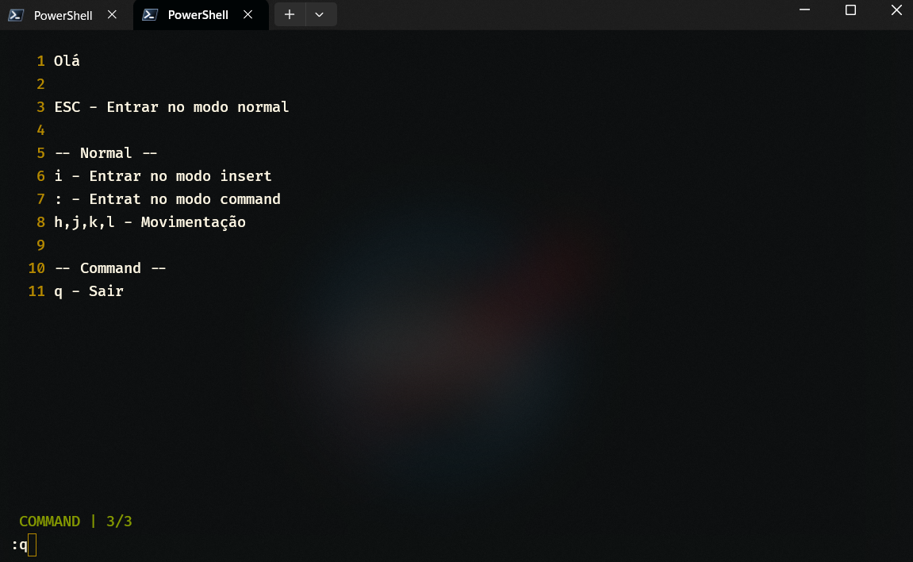

<h2 align="center"> Go Nvim</h2>


Me interessei por Go e resolvi estudá-lo. Recentemente, tive a vontade de criar um projeto em Go que escapasse de uma API Rest.
Em certo dia, vi um post no Reddit relacionado a um editor de texto escrito em Go, o [Gkilo](https://github.com/vcnovaes/gkilo), então decidir criar o meu próprio, como usuário do Neovim, me inspirando nele. Este é um projeto relativamente simples, mas pretendo aprimorar o seu desenvolvimento com o decorrer do tempo.


### Funcionalidades
- Escrita de texto
- Sistemas de modos (normal, insert, command)
- Lógica de comandos
- StatusLine 
- Gerenciamento de arquivos (criar, ler, editar, abrir)

### ⌨️ Keymaps e Comandos  

| Mode | Key | Ação|
|------|-----|--------|
| Normal    | i   | modo insert  
|| :   | digitar comando  
|| h| esquerda
||j|para baixo
||k|para cima
||l|direita
| Insert | ESC | sair do modo insert

| Comando | Ação | 
|-----------|----|
| : w [ file ]| Salvar arquivo |
| : q| Sair|
|: open [ file ]| Abrir um arquivo |

### Instalação

##### Dependências
- [Go](https://go.dev/)
- Git


##### Clone e acesse o repositório 
```bash
git clone https://github.com/jhenriquem/GoNvim
cd GoNvim
```

##### Instale todas os pacotes
```bash
go mod tidy
```
##### Execute o arquivo main.go
```bash
go run ./cmd/main.go
```
#### Executar o build 
```bash
go build -o go-nvim.exe ./cmd/main.go

./go-nvim.exe [ file ]
```

#### Ispirações
- [Neovim](https://github.com/neovim/neovim) Vim-fork focado em extensibilidade e usabilidade
- [Gkilo](https://github.com/vcnovaes/gkilo) Um editor de texto escrito em Go
