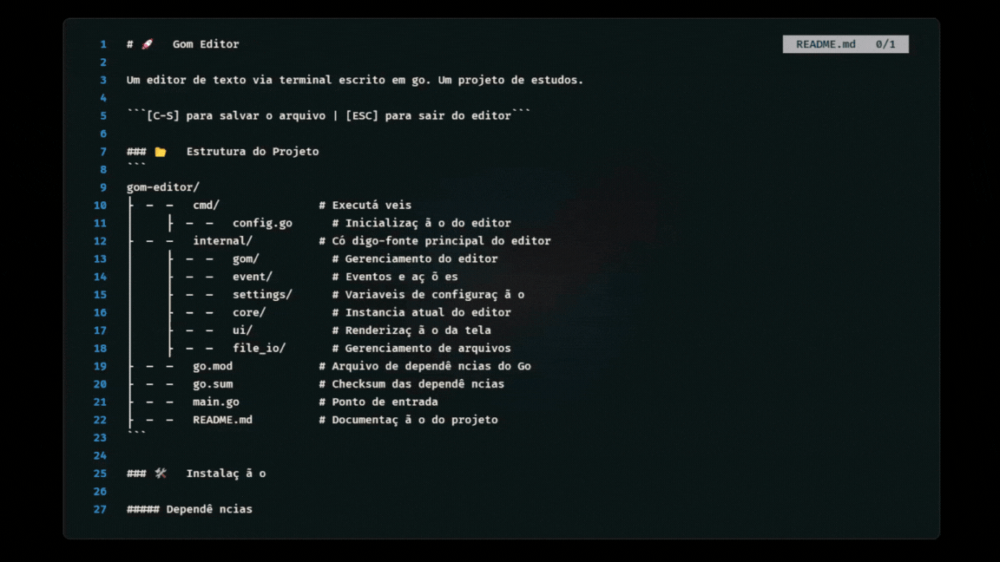

# 🚀 Gom Editor  


Um editor de texto via terminal escrito em go. Um projeto de estudos. 

```[C-S] para salvar o arquivo | [ESC] para sair do editor```

### 📂 Estrutura do Projeto
```
gom-editor/
├── cmd/               # Executáveis 
│   ├── config.go      # Inicialização do editor
├── internal/          # Código-fonte principal do editor
│   ├── gom/           # Gerenciamento do editor
│   ├── event/         # Eventos e ações
│   ├── settings/      # Variaveis de configuração 
│   ├── core/          # Instancia atual do editor
│   ├── ui/            # Renderização da tela 
│   ├── file_io/       # Gerenciamento de arquivos   
├── go.mod             # Arquivo de dependências do Go
├── go.sum             # Checksum das dependências
├── main.go            # Ponto de entrada
├── README.md          # Documentação do projeto
```

### 🛠 Instalação

##### Dependências
- [Go](https://go.dev/)
- Git

1.  Clone e acesse o repositório 
```bash
git clone https://github.com/jhenriquem/gom-editor
cd gom-editor
```
2. Rode o executavel 
```bash 
./exec/gom.exe
```


